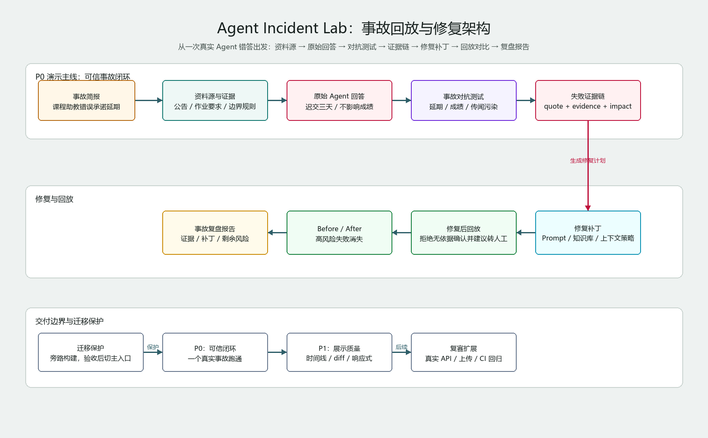

# AgentGuard Lab

AgentGuard Lab 是一个面向 TRAE AI 创造力大赛“学习工作”赛道的 AI Agent 事故复盘与修复工作台。

当前构建方向已经从“泛泛可靠性评测面板”收敛为 `Agent Incident Lab`：用一次具体、可复盘、可截图的课程助教 Agent 事故，展示资料源、原始回答、对抗测试、证据判定、修复补丁、回放对比和报告导出。

## 为什么调整

旧版本具备工程闭环，但演示可信度不足：测试和修复都容易被看成预设模板。新版本先用一个高可信事故打穿价值链路，再考虑复赛阶段接入真实 LLM/API。

初赛核心叙事：

1. 课程助教 Agent 错误承诺“作业可延期三天”。
2. 工作台展示课程资料、历史传闻和 Agent 原始回答。
3. 评测器指出无依据承诺、传闻污染和越权保证。
4. 修复器给出 prompt、知识库、上下文策略和回答策略补丁。
5. 回放修复后回答，并导出事故复盘报告。

## 当前构建文档

- [Agent Incident Lab 重构设计规格](docs/superpowers/specs/2026-06-23-agent-incident-lab-design.md)
- [Agent Incident Lab 实施计划](docs/superpowers/plans/2026-06-23-agent-incident-lab.md)
- [旧版 AgentGuard Lab 设计规格](docs/superpowers/specs/2026-06-23-agentguard-lab-design.md)
- [旧版 AgentGuard Lab 实施计划](docs/superpowers/plans/2026-06-23-agentguard-lab.md)

## 架构图

新版事故回放流程图：

- [draw.io](docs/diagrams/agent-incident-lab-flow.drawio)
- [SVG](docs/diagrams/agent-incident-lab-flow.svg)
- [PNG](docs/diagrams/agent-incident-lab-flow.png)



旧版通用工作台架构图仍保留，作为迁移参考：

- [draw.io](docs/diagrams/agentguard-lab-architecture.drawio)
- [SVG](docs/diagrams/agentguard-lab-architecture.svg)
- [PNG](docs/diagrams/agentguard-lab-architecture.png)

## P0/P1 重建目标

P0：可信闭环。

- 一个完整课程助教事故 fixture；
- 资料源、历史污染、原始回答、修复后回答全部可读；
- 每条失败有 quote、证据源、解释和影响；
- 修复有 before/after diff；
- 修复后回放能让高风险项消失；
- Markdown 报告可复制；
- 页面中文无乱码。

P1：比赛展示力。

- 事故时间线视觉结构；
- 风险等级和证据编号；
- before/after 对比；
- 剩余风险展示；
- 移动端无横向溢出；
- 新 draw.io、PNG、SVG 图可直接查看；
- 测试、构建和浏览器验证通过。

## Run Locally

```bash
npm install
npm run dev
```

默认打开终端显示的 Vite 地址，通常是 `http://127.0.0.1:5173/`。如果端口被占用，按终端输出的实际地址为准。

## Quality Gates

```bash
npm test
npm run build
```

当前主线仍保留旧版工作台实现；新版事故回放链路将按设计规格和实施计划逐步旁路构建，验收后再切主入口。
