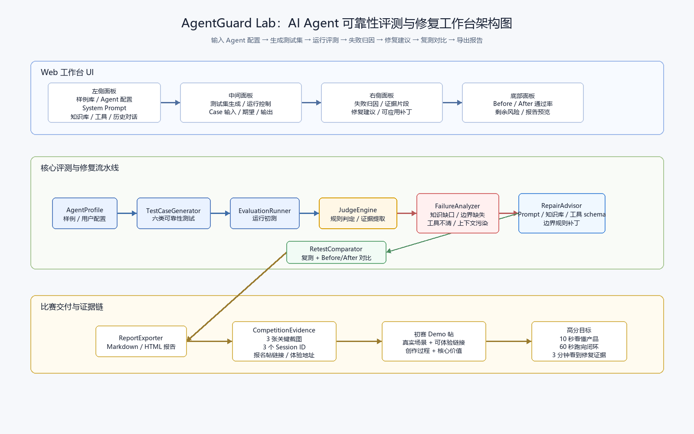

# AgentGuard Lab

AI Agent 可靠性评测与修复工作台，面向 TRAE AI 创造力大赛“学习工作”赛道。

## Project Goal

AgentGuard Lab 帮助 AI Agent 开发者把项目从“能演示”推进到“可测试、可解释、可维护、可交付”。核心闭环是：

1. 输入或选择 Agent 配置。
2. 自动生成可靠性测试集。
3. 运行评测并展示失败证据。
4. 定位失败原因。
5. 生成可复测的修复建议。
6. 复测并展示 before/after 对比。
7. 导出比赛和答辩可用报告。

## Current Planning Artifacts

- [项目设计规格](docs/superpowers/specs/2026-06-23-agentguard-lab-design.md)
- [实现计划](docs/superpowers/plans/2026-06-23-agentguard-lab.md)
- [draw.io 架构图](docs/diagrams/agentguard-lab-architecture.drawio)
- [SVG 架构图](docs/diagrams/agentguard-lab-architecture.svg)
- [PNG 架构图](docs/diagrams/agentguard-lab-architecture.png)



## MVP Scope

初赛 MVP 采用静态 Web 工作台形态，优先保证可体验闭环和现场演示稳定性。计划技术栈是 Vite + React + TypeScript，初赛阶段使用本地样例和确定性评测规则，避免依赖后端或真实 LLM API。

## Run Locally

```bash
npm install
npm run dev
```

然后打开 `http://127.0.0.1:5173/`。

## Quality Gates

```bash
npm test
npm run build
```

当前 MVP 的自动化覆盖包括：测试集生成、规则判分、修复复测状态机、React 工作台主流程。

## Demo Flow

1. 选择一个内置 Agent 样例。
2. 点击 `生成测试集`，得到 6 个可靠性维度用例。
3. 点击 `运行评测`，查看失败证据、失败类型和修复建议。
4. 点击 `应用修复并复测`，查看 before/after 通过率和 Markdown 报告预览。

## Submission Prep

- [初赛提交检查清单](docs/submission/demo-post-checklist.md)
