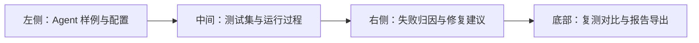
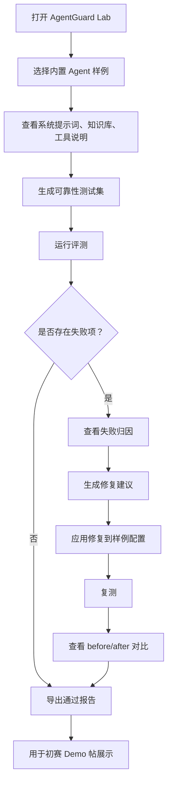
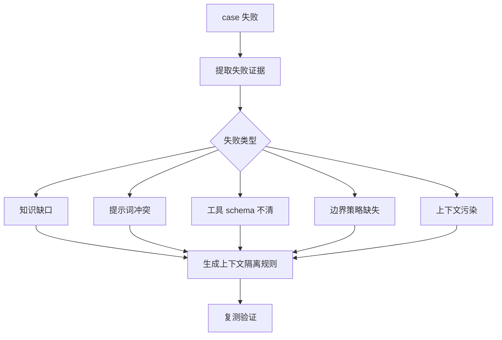
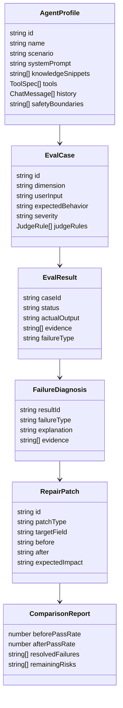

# AgentGuard Lab Design Spec

日期：2026-06-23

## 1. 项目定位

AgentGuard Lab 是面向 AI Agent 开发者的可靠性评测与修复工作台。它帮助正在做课程助手、代码评审助手、知识库问答助手、个人作品集 Agent、营销助手的小团队，把 Agent 从“能演示”推进到“可测试、可解释、可维护、可交付”。

比赛赛道锁定为“学习工作”。项目不叠加“社会公益”附加赛题，避免主题被稀释。核心叙事是开发者工具、AI 应用质量保障、Agent 工程化交付。

## 2. 初赛边界

初赛目标不是完整平台，而是一个可体验、可讲清、可截图的网页 Demo。Demo 必须跑通一条完整闭环：

1. 选择 Agent 样例或上传 Agent 配置。
2. 自动生成可靠性测试集。
3. 运行评测并展示每条 case 的输入、期望、实际输出、通过状态。
4. 对失败项做归因。
5. 给出可复测的修复建议。
6. 应用建议后复测并展示 before/after 对比。
7. 导出报告，用于比赛帖和答辩展示。

不在初赛范围内：

- 多租户账号体系。
- 真实生产级安全审计。
- 接入任意第三方 Agent 平台。
- 完整自动修改外部代码库。
- 大规模并发评测。
- 长期历史趋势分析。

## 3. 得分策略

| 评分维度 | 权重 | 本项目打法 |
| --- | ---: | --- |
| 创新性 | 30% | 不做普通聊天助手，做 Agent 质量保障工作台；把评测生成、失败归因、修复建议、复测对比组织成闭环。 |
| 实用性 | 30% | 面向真实开发场景：课程助手、代码评审助手、知识库问答助手、个人作品集 Agent 都需要证明可靠性。 |
| 完成度 | 20% | 初赛只做一个完整可体验路径，减少平台化分支，让评委能从输入到报告完整走完。 |
| 美观度/设计体验 | 20% | 使用工程诊断台式布局：左侧配置，中间运行，右侧归因，底部对比，让评委快速理解价值。 |

高分判断标准：评委 10 秒内看懂产品是什么，60 秒内能跑完一个失败到修复的例子，3 分钟内能看到报告证明修复有效。

## 4. 目标用户与核心痛点

目标用户：

- 正在做 AI Agent 课程项目、竞赛项目、作品集项目的学生开发者。
- 正在做内部知识库、客服、运营、代码辅助工具的小团队。
- 需要向导师、评委、队友证明 Agent 可靠性的项目作者。

痛点：

- Agent Demo 常展示顺利样例，失败样例被忽略。
- 系统提示词、知识库、工具 schema、对话历史之间容易冲突。
- 开发者不知道失败来自知识缺口、边界缺失、工具定义不清，还是上下文污染。
- 修改 prompt 后缺少复测，无法证明“真的变好”。
- 比赛或答辩时，评委难以判断 Agent 是否只是包装出来的聊天壳。

## 5. 推荐产品形态

采用单页 Web 工作台。初赛展示重点是“评测闭环”，不是后台能力复杂度。

页面区域：

- 顶部状态栏：当前样例、通过率、失败数量、当前阶段。
- 左侧面板：样例库、系统提示词、知识库片段、工具说明、对话记录。
- 中间面板：测试 case 列表、运行按钮、每条 case 的输入/期望/实际输出。
- 右侧面板：失败类型、证据片段、修复建议、可应用的修复补丁。
- 底部面板：before/after 通过率、失败类别变化、报告预览和导出按钮。

## 6. 核心流程

### 6.1 用户主流程

### 6.2 评测流水线

```mermaid
flowchart LR
    Config["Agent 配置"] --> CaseGen["测试集生成器"]
    CaseGen --> Cases["EvalCase[]"]
    Cases --> Runner["评测运行器"]
    Runner --> Judge["判定器"]
    Judge --> Results["EvalResult[]"]
    Results --> Analyzer["失败归因器"]
    Analyzer --> Advice["修复建议器"]
    Advice --> Patch["RepairPatch"]
    Patch --> Retest["复测运行器"]
    Retest --> Comparison["ComparisonReport"]
```

### 6.3 失败处理流程

## 7. 功能板块细分

### 7.1 样例库 Sample Library

目的：让评委不需要准备材料也能体验完整流程。

初赛内置 3 个样例：

1. 课程问答 Agent：容易出现知识库不足、幻觉、边界拒答问题。
2. 代码评审 Agent：容易出现工具参数不清、建议无证据、越界修改问题。
3. 个人资料/作品集 Agent：容易出现隐私边界、事实编造、旧信息污染问题。

每个样例包含：

- system prompt。
- knowledge snippets。
- tools schema。
- chat history。
- expected weak spots。
- repaired version。

### 7.2 Agent 配置编辑器 Agent Config Editor

目的：展示 AgentGuard Lab 可以处理真实 Agent 配置，而不只是固定演示。

字段：

- Agent 名称。
- 使用场景。
- 系统提示词。
- 知识库片段。
- 工具说明。
- 历史对话。
- 安全边界说明。

初赛编辑能力只需要支持表单修改，不需要完整上传解析器。

### 7.3 测试集生成器 Test Case Generator

目的：把 Agent 配置转化为可运行的可靠性测试。

测试维度：

- factuality：事实性。
- boundary_refusal：边界拒答。
- tool_calling：工具调用。
- context_contamination：上下文污染。
- hallucination：幻觉。
- instruction_conflict：指令冲突。

生成策略：

- 初赛采用规则模板 + 样例弱点映射，保证可控和稳定。
- 每个维度至少生成 1 条 case。
- 每条 case 包含输入、期望行为、判定规则、严重程度。

### 7.4 评测运行器 Evaluation Runner

目的：模拟用户向 Agent 发问，并收集实际输出。

初赛版本可以使用内置 response fixtures，不强依赖外部 LLM API。这样现场演示更稳定，也更容易部署为静态网页。

运行器输出：

- case id。
- user input。
- expected behavior。
- actual output。
- status：pass / fail / warning。
- evidence：触发判定的文本片段。
- duration。

### 7.5 判定器 Judge

目的：判断每条 case 是否满足期望。

初赛判定方式：

- keyword includes / excludes。
- expected tool name。
- forbidden disclosure pattern。
- citation requirement。
- refusal requirement。

后续扩展可加入 LLM-as-judge，但初赛展示应优先稳定。

### 7.6 失败归因器 Failure Analyzer

目的：把失败从“没过”解释成具体原因。

归因类型：

- knowledge_gap：缺少事实依据。
- prompt_conflict：系统指令互相冲突。
- tool_schema_ambiguity：工具定义不清。
- boundary_missing：缺少拒答边界。
- context_pollution：历史上下文污染。
- unsupported_claim：输出了无证据断言。

每个归因必须带证据，避免变成泛泛建议。

### 7.7 修复建议器 Repair Advisor

目的：给出可以复测的修复，而不是只给自然语言建议。

修复类型：

- system_prompt_patch。
- knowledge_patch。
- tool_schema_patch。
- boundary_rule_patch。
- context_policy_patch。

每条建议包含：

- 修复目标。
- 修改前问题。
- 建议修改文本。
- 预计影响的测试维度。
- 复测按钮。

### 7.8 复测对比 Retest Comparator

目的：证明修复有效。

对比指标：

- 总通过率变化。
- 各失败类型数量变化。
- 高严重度失败是否消失。
- 新增 warning 数量。
- before/after case 列表差异。

### 7.9 报告导出 Report Exporter

目的：服务比赛提交和答辩展示。

导出内容：

- Agent 基本信息。
- 测试集摘要。
- 初测结果。
- 失败归因。
- 修复建议。
- 复测结果。
- before/after 对比。
- TRAE 开发过程说明截图位置。

初赛版本导出 Markdown 或 HTML 即可。

### 7.10 比赛证据板块 Competition Evidence

目的：让 Demo 帖满足初赛要求。

内容：

- 至少 3 张关键开发步骤截图的位置记录。
- 至少 3 个关键任务 Session ID 的记录。
- 报名帖链接。
- Demo 体验链接或 HTML zip 文件说明。
- 作品原创与素材说明。

## 8. 数据模型

## 9. 推荐技术方案

初赛推荐做成 Vite + React + TypeScript 的静态网页应用。

理由：

- 静态部署简单，适合社区上传 HTML zip 或公开体验链接。
- React 适合搭建工作台式交互界面。
- TypeScript 让数据结构清晰，便于后续复赛扩展。
- 不依赖后端和真实 LLM API，现场演示稳定。

模块边界：

- `src/domain`：类型、fixtures、样例数据。
- `src/evaluation`：测试生成、判定、评测运行。
- `src/repair`：失败归因、修复建议、复测对比。
- `src/reporting`：报告生成。
- `src/ui`：页面组件。
- `src/state`：工作台状态机。

## 10. 错误与空状态

必须展示的状态：

- 未选择样例：提示选择内置样例。
- 未生成测试集：运行按钮禁用。
- 评测运行中：显示逐条运行进度。
- 无失败项：直接引导导出报告。
- 有失败项：突出失败归因和修复按钮。
- 复测后仍有失败：显示剩余风险，而不是强行宣称修复完成。
- 报告导出失败：展示可复制 Markdown 文本。

## 11. 验收标准

初赛 MVP 通过标准：

1. 页面打开后能选择至少 3 个内置 Agent 样例。
2. 每个样例能生成不少于 6 条测试 case。
3. 至少 1 个样例能展示失败、归因、修复、复测通过率提升。
4. 每条失败都有明确证据片段。
5. 每条修复建议都能映射到一个目标字段。
6. 复测对比包含 before/after 通过率。
7. 能导出可复制的 Markdown 或 HTML 报告。
8. 页面适配桌面和常见手机宽度，文本不重叠。
9. Demo 帖可以附上至少 3 张开发截图和 3 个 Session ID。

## 12. 复赛扩展方向

复赛可以扩展：

- 接入真实 LLM API 运行 Agent 输出。
- 支持上传 prompt / markdown / JSON 工具 schema。
- 支持自定义测试维度。
- 支持 LLM-as-judge 与人工复核。
- 支持历史版本趋势。
- 支持团队共享报告。
- 支持 GitHub Action 或 CLI 形式的 Agent 回归测试。

复赛扩展必须围绕“可靠性评测与修复闭环”，不能偏离到泛平台。

## 13. 初赛提交叙事

Demo 帖建议叙事顺序：

1. 一句话说明：AgentGuard Lab 是 AI Agent 可靠性评测与修复工作台。
2. 展示真实痛点：普通 Agent Demo 只演示顺利样例，缺少失败证据和复测。
3. 展示核心流程截图：配置 -> 生成测试 -> 运行评测 -> 失败归因 -> 修复建议 -> 复测对比 -> 报告导出。
4. 展示 TRAE 实践过程：关键任务拆解、关键截图、Session ID。
5. 展示体验地址或 zip。
6. 展示下一步：接入真实 Agent、增加自定义测试集、支持 CI 回归。
